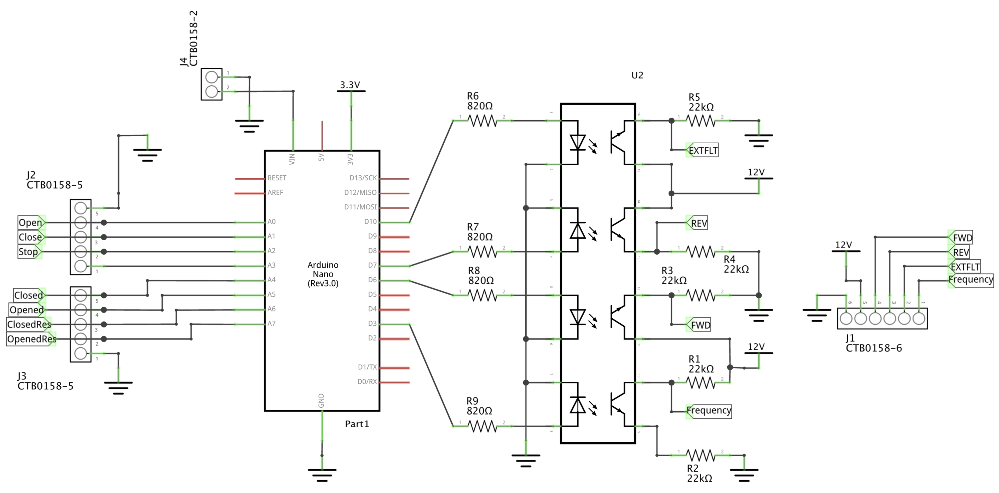

This project builds a Gate Controller for a Sliding Gate using a Eaton DE1 Variable Speed Starter and an Arduino Nano.
There are four parts of that project:
- An existing Sliding Gate with Gearbox Motor
- A new [Eaton DE1 Variable Speed Starter](./datasheet/Eaton_MN040011_DE.pdf)
- The Arduino Gate Controller Hardware
- The Arduino Gate Controller Software

# Existing Gate
The existing Gate has three lower end contacts and three the upper end contacts. I've implemented an independent safety circuit with a lower and an upper contact which interrupt the motor - DE1 connection if triggered.
The other for contacts (2lower and 2higher) are connected to the Arduino.

# Eaton DE1
The Eaton DE1 is configured for Mode 1 which provides control for direction, External Fault (EXTFLT) and Speed (f-REF)

# Hardware
The images below are showing the final hardware and a drawing with the pin description.

| final            | drawing           |
| ---            | ---                 |
|  |  |

The Shematic was done with Fritzing. 

Unfortunately the 20mA supply from Eaton DE1 was not sufficient for powering the circuit.

# Software
The block diagram shows the structure of the Software.

The inputs are periodically (driven by timer) retrieved. All inputs are simple push buttons or contacts which can be pushed(closed) or released(open). 
These pushed/released events are communicated by using callbacks to the State Machine. The statemachine then controls the four outputs for the DE1 Variable Speed Starter. For details see the state diagram below.

Along that a logging infrastructure collects all log messages with severities and outputs it on terminal.

The Project can be compiled with the [Arduino App](https://www.arduino.cc/download) or by using 
[CLion](https://www.jetbrains.com/clion/). This is why the project folder contains all the CMake files.
